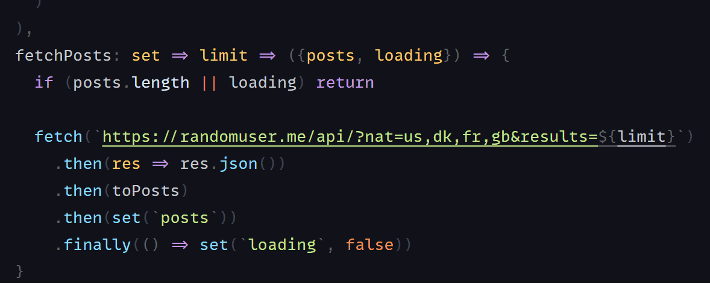

# Holy State
> Hook-based state management library for [React](https://github.com/facebook/react) applications.

<br/>
<br/>
<div align="center">
  
</div>
<br/>
<br/>
<br/>

## Quick intro
Holy moly, you are here! You're more than welcome!

It's all about state management with react hooks and immutable state. Think of it as a utility for creating hooks that can store a state. It's similar to react 'useState' hook, except that it stays outside of components and shares a global state across the entire application. The coolest part is that you are not required to use any context providers, observables, subscribers, or connectors: no boilerplate code but hooks.

```js
import {createState} from '@holycow/state'


const useAuth = createState({
  token: ``,
  error: ``,
  loading: false,
  isTokenValid: state => isValid(state.token), // 👈 computed value
  login: set => formData => { // 👈 action
    set(`error`, ``)
    set(`loading`, true)
    fetch(`/api/login`, {method: `POST`, body: formData})
      .then(res => res.json())
      .then(set(`token`)) // 👈 set is curried function
      .catch(set(`error`))
      .finally(() => set(`loading`, false))
  }
})

// 👇 hooks can be used out of components
const onSubmit = event => {
  const {login} = useAuth()
  login(new FormData(event.target))
  event.preventDefault()
}

const Login = () => {
  const {loading, error} = useAuth() // 👈 get any state value
  const text = loading ? `Submitting` : `Login`

  return (
    <form onSubmit={onSubmit}>
      <input name='email' type='text'/>
      <input name='password' type='password'/>
      <p>{error}</p>

      <button type='submit' disabled={loading}>
        {text}
      </button>
    </form>
  )
}
```

### 🍿 Demo
Here you can find a demo project:
 - 📺 [Online demo](https://codesandbox.io/s/github/sultan99/cards/tree/main)
 - 🐙 [Github repo](https://github.com/sultan99/cards)

### 📦 Installation
```sh
npm install @holycow/state
```
### 🪝 Your store is a hook
The holy hook returns the state object and builtin `set` function.

```js
const initState = {
  id: 1,
  name: `Peter`,
  address: {
    house: 31,
    street: `Spooner`,
  },
}

const useUser = createState(initState)

// usage
// 👇 holy-state hook returns object
const {id, name, address, set} = useUser() 
const [{id, name, address}, set] = useState(initState)
// 👆 react useState hook returns array 
```

You can modify the state values with the `set` function in different ways:
```js
const {set} = useUser()

set(state => ({...state, name: `Boogle`})) // a whole state
set(`name`, `Ovuvuevuevue`) // key & value
set(`id`,  prevId => prevId + 1) // key & function
set(`address.street`, `rue de Beggen`) // path & value, no spreading objects
```

The `set` is a function that has been curried. You can apply parameters to it partially one by one:

```js
const setId = set(`id`) // returns function which will update `id`
setId(2) // actual updates
setId(prevId => prevId + 1) // all above mentioned update ways are valid

fetch(`/api/users/${312}/address`)
  .then(res => res.json())
  .then(set(`address`)) // equals .then(data => set(`address`, data))
```

### ⚡ Boost performance
A state hook can be used anywhere, even outside a react component. As you may be aware, declaring a function inside a component slows performance because the code is rebuilt on each render. If you want to avoid this issue, you should either use the 'useCallback' hook or create the handler external to the component:

```jsx
/**
 * The combo feature 🍔 + 🌶️ = ⚡
 * 1) curried function,
 * 2) hook used outside component
 */ 
const {set} = useUser()
const setName = set(`name`)
// 👆 these two lines 
// can be replaced by one 👇
const setName = useUser().set(`name`)

// the handler is outside component and created once
const handleChange = event => {
  setName(event.currentTarget.value)
}

const Input = () => {
  const {name} = useUser()
  return (
    <input value={name} onChange={handleChange}/>
  )
}
```

If you are familiar with [ramda](https://ramdajs.com/docs/#compose) like libraries, you can compose the functions:

```js
const handleChange = R.compose(
  useUser().set(`name`), 
  R.props([`currentTarget`, `value`]),
)
```

### 🎬 Actions
An action is any piece of code that modifies the state and targets some specific task, unlike the `set` function, which is more generic and used for a simple value update.

When we declare an action we pass curried function with two or three parameters:
 - `set` — state setter
 - `payload` — payload of the action
 - `state` — the current state of the hook, an optional parameter can be omitted

```js
const useTodos = createState({
  todos: [
    {id: 1, checked: true, description: `Buy milk`},
    {id: 2, checked: false, description: `Clean room`},
  ],
 /**
  * Action creates a new todo
  * @param {string} description - Payload of the action
  */ 
  addTodo: set => description => state => {
    const {todos} = state
    const id = todos.reduce((acc, {id}) => Math.max(id + 1, acc), 0)
    const newTodo = {id, description, checked: false}

    set(`todos`, [...todos, newTodo])
  },
 /**
  * Action clear todos
  * the third parameter is skipped
  */ 
  clearTodos: set => () => {
    set(`todos`, [])
  },
})
```

When the action is called only payload should be passed:
```js
const {addTodo, clearTodos} = useTodos()
addTodo(`Find a job`)
clearTodos()
```


### 🧮 Computed values
A computed value is a value returned by a function, where its input can be the state or any other hook. The value gets recomputed if one of the inputs has changed. Therefore to modify the computed value, we should modify inputs. Conceptually, they are very similar to formulas in spreadsheets.

```js
const useFilter = createState({
  filter: `all`, // all | completed | uncompleted
})

const useTodos = createState({
  todos: [
    {id: 1, checked: true, description: `Buy milk`},
    {id: 2, checked: false, description: `Clean room`},
  ],
  /**
   * Computed value
   * if `filter` or `todos` get changed
   * the function will be recomputed
   * @returns {Todo[]}
   */ 
  filteredTodos: state => {
    const {todos} = state 
    const {filter} = useFilter()
    const isAll = filter === `all`
    const isCompleted = filter === `completed`
  
    return isAll ? todos : todos.filter(
      ({checked}) => checked === isCompleted
    )
  }
})

// usage
const TodoList = () => {
  const {filteredTodos} = useTodos()

  return (
    <ul>
      {filteredTodos.map(todo => 
        <li key={todo.id}>
          {todo.description}
        </li>
      )}
    </ul>
  )
}

```

### 🤹 Selectors
Selectors are similar to CSS selectors. Instead of the DOM we select a value from the state.
So it retrieves the value at a given path:

```js
const useMessages = createState({
  author: {
    id: 100,
    name: `Peter`,
  },
  messages: [
    {id: 1, text: `Hello`},
    {id: 2, text: `World!`},
  ]
})

const {author} = useMessages()
const authorName = author.name
// 👆 these two lines are equivalent 👇
const authorName = useMessages(`author.name`)


const {messages} = useMessages()
const firstMessage = messages[0].text
// 👆 these two lines are equivalent 👇
const firstMessage = useMessages(`messages.0.text`)
```

The same trick you can do with actions or `set` function:
```js
const setUser = useUser(`set`)
const setMessage = useMessages(`set`)
// 👆 equivalent 👇
const {set: setUser} = useUser()
const {set: setMessage} = useMessages()
```

### 🗿 Static variables
We showed some snippets above on how to use hook outside of react components, but this is only true for set and actions. To get variables from the state outside of a component, use a selector with the prefix `@`:

```js
const name = useUser(`@name`)
```

By adding `@`, we tell hook to export a static value, which means that if the value changes, we will not get the changed value later, but we will always get the most recent value at the time of the request.

We used the `useUser` hook in a socket callback in the following snippet. Although the function is not a react component, we can access the state variables: 

```js
socket.on(`message`, json => {
  const userId = useUser(`@id`)
  const {set} = useMessages()
  const data = JSON.parse(json);

  if (data.receiverId === userId) {
    set(`messages`, R.append(data.message))
  }  
})
```

### 🎏 Store: Single vs Multiple
It is entirely up to you to go with a single store or multiple domain stores, with no restrictions. 

Even so, by splitting store into small states, you may get some benefits. For example, you can reduce the size of the main bundle. Let's consider case when our app has two different states for authorized users and guests. We could load the user profile state in lazy mode when the user gets logged in. But before that, we fetch only the required hooks to handle the guest state.

On the other hand, splitting store helps better organize and understand the application state. The following hooks, are more implicit and meaningful:

```js
useModal()
useSearch()
usePosts()
useTodos()
```

comparing to:

```js
useStore()
```

### 📎 TypeScript
Important: Typescript ^4.3 above is the recommended version to work with holy state hooks.



```tsx
import type {Action, ActionPayload, Computed, ComputedPayload} from '@holycow/state'
import {createState} from '@holycow/state'

/**
 * Computed<StateType, ReturnType>
 * ComputedPayload<StateType, PayloadType, ReturnType>
 * Action<StateType>
 * ActionPayload<StateType, PayloadType>
 */

type Todo = {
  id: number
  checked: boolean
  description: string
}

type UseTodos = {
  filter: 'all' | 'completed' | 'uncompleted'
  todos: Todo[]
  filteredTodos: Computed<UseTodos, Todo[]>
  findTodo: ComputedPayload<UseTodos, number, Todo | undefined>
  addTodo: ActionPayload<UseTodos, string>
  clearTodos: Action<UseTodos>
}

const useTodos = createState<UseTodos>({
  filter: 'all',
  todos: [
    {id: 1, checked: true, description: `Buy milk`},
    {id: 2, checked: false, description: `Clean room`},
  ],
  // Computed value
  filteredTodos: state => {
    const {filter, todos} = state 
    const isAll = filter === `all`
    const isCompleted = filter === `completed`
  
    return isAll ? todos : todos.filter(
      ({checked}) => checked === isCompleted
    )
  },
  // Computed value with payload
  findTodo: state => id => {
    const {todos} = state
    return todos.find(todo => todo.id === id)
  },
  // Action using state
  addTodo: set => description => state => {
    const {todos} = state
    const id = todos.reduce((acc, {id}) => Math.max(id + 1, acc), 0)
    const newTodo = {id, description, checked: false}

    set(`todos`, [...todos, newTodo])
  },
  // Action
  clearTodos: set => () => {
    set(`todos`, [])
  }
})
```

## 🏃‍♂️ To be continued
Don't miss out on all the new and improved features in the upcoming version!
